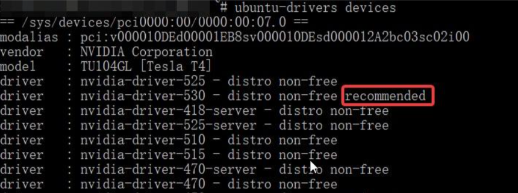

# 
# 1.下载安装
显卡驱动
lspci | grep -i nvidia


可再输入下面命令，以查看显卡型号以及推荐的驱动版本。

ubuntu-drivers devices


如果我们愿意安装这个版本的驱动，则输入即可安装该驱动：

sudo ubuntu-drivers autoinstall


再次输入

nvidia-smi
CUDA Version: 12.6 

[https://developer.download.nvidia.cn/compute/cudnn/redist/cudnn/linux-x86_64/)


wget https://developer.download.nvidia.com/compute/cuda/12.2.0/local_installers/cuda_12.2.0_535.54.03_linux.run
sudo sh cuda_12.2.0_535.54.03_linux.run  --override

只选择Toolkit

vim ~/.bashrc
export PATH=/usr/local/cuda-12.1/bin${PATH:+:${PATH}}
export LD_LIBRARY_PATH=/usr/local/cuda-12.1/lib64${LD_LIBRARY_PATH:+:${LD_LIBRARY_PATH}}
source ~/.bashrc 

# 2.cudnn
[https://developer.download.nvidia.cn/compute/cudnn/redist/cudnn/windows-x86_64/](https://developer.download.nvidia.cn/compute/cudnn/redist/cudnn/)


tar -xf cudnn-linux-x86_64-8.9.7.29_cuda11-archive.tar.xz

复制文件到CUDA安装目录
sudo cp cudnn-linux-x86_64-8.9.7.29_cuda11-archive/include/* /usr/local/cuda-11.8/include

sudo cp cudnn-linux-x86_64-8.9.7.29_cuda11-archive/lib/libcudnn* /usr/local/cuda-11.8/lib64

添加读取权限
sudo chmod a+r /usr/local/cuda-11.8/include/cudnn.h
sudo chmod a+r /usr/local/cuda-11.8/lib64/libcudnn*


测试
cat /usr/local/cuda-11.8/include/cudnn_version.h | grep CUDNN_MAJOR -A 2


# 3.https://pytorch.org/

# 
```
import torch

# 检查CUDA是否可用
cuda_available = torch.cuda.is_available()

if cuda_available:
    # 获取当前CUDA设备数量
    num_cuda_devices = torch.cuda.device_count()
    print(f"找到 {num_cuda_devices} 个CUDA设备.")

    # 输出每个CUDA设备的名称
    for i in range(num_cuda_devices):
        print(f"CUDA 设备 {i}: {torch.cuda.get_device_name(i)}")
else:
    print("CUDA 不可用.")

# 使用CUDA进行张量运算示例
if cuda_available:
    # 将张量移到CUDA设备上
    device = torch.device("cuda")          # 选择第一个CUDA设备
    tensor = torch.randn(3, 3).to(device)  # 创建一个随机张量并移到CUDA设备
    result = tensor.mm(tensor.t())         # 在CUDA设备上执行矩阵乘法运算
    print(result)
else:
    print("无法演示CUDA张量运算，因为CUDA不可用.")

```