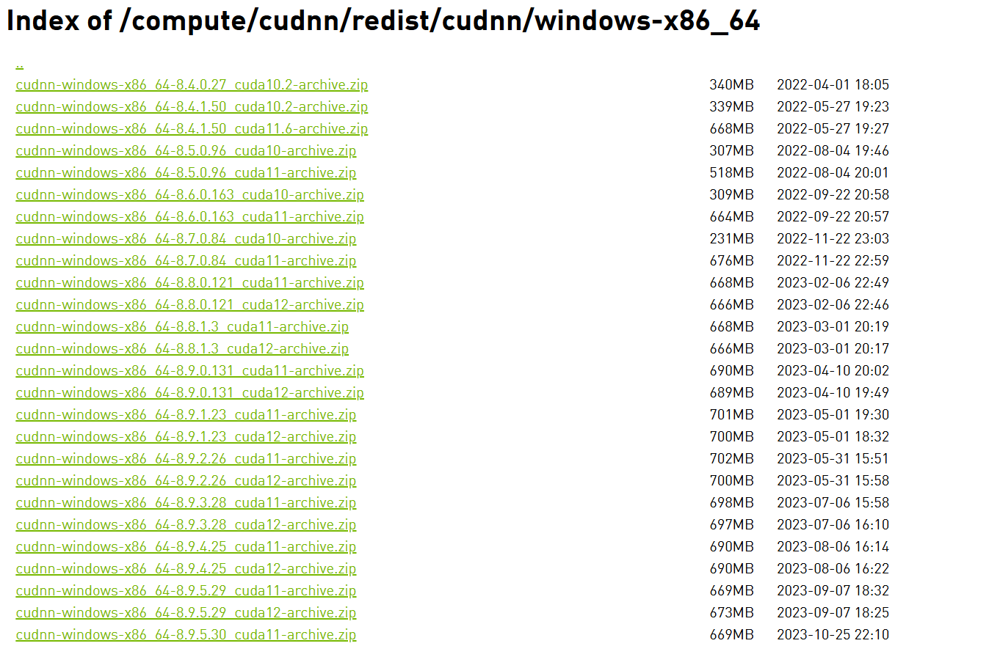

# 
# 1.下载安装
nvidia-smi
CUDA Version: 12.6 

[https://developer.nvidia.com/cuda-12-2-2-download-archive?target_os=Windows&target_arch=x86_64&target_version=11&target_type=exe_local](https://developer.nvidia.com/cuda-12-2-2-download-archive?target_os=Windows&target_arch=x86_64&target_version=11&target_type=exe_local)

# 2.cudnn
[https://developer.download.nvidia.cn/compute/cudnn/redist/cudnn/windows-x86_64/](https://developer.download.nvidia.cn/compute/cudnn/redist/cudnn/windows-x86_64/)

# 3.https://pytorch.org/

# 
```
import torch

# 检查CUDA是否可用
cuda_available = torch.cuda.is_available()

if cuda_available:
    # 获取当前CUDA设备数量
    num_cuda_devices = torch.cuda.device_count()
    print(f"找到 {num_cuda_devices} 个CUDA设备.")

    # 输出每个CUDA设备的名称
    for i in range(num_cuda_devices):
        print(f"CUDA 设备 {i}: {torch.cuda.get_device_name(i)}")
else:
    print("CUDA 不可用.")

# 使用CUDA进行张量运算示例
if cuda_available:
    # 将张量移到CUDA设备上
    device = torch.device("cuda")          # 选择第一个CUDA设备
    tensor = torch.randn(3, 3).to(device)  # 创建一个随机张量并移到CUDA设备
    result = tensor.mm(tensor.t())         # 在CUDA设备上执行矩阵乘法运算
    print(result)
else:
    print("无法演示CUDA张量运算，因为CUDA不可用.")

```